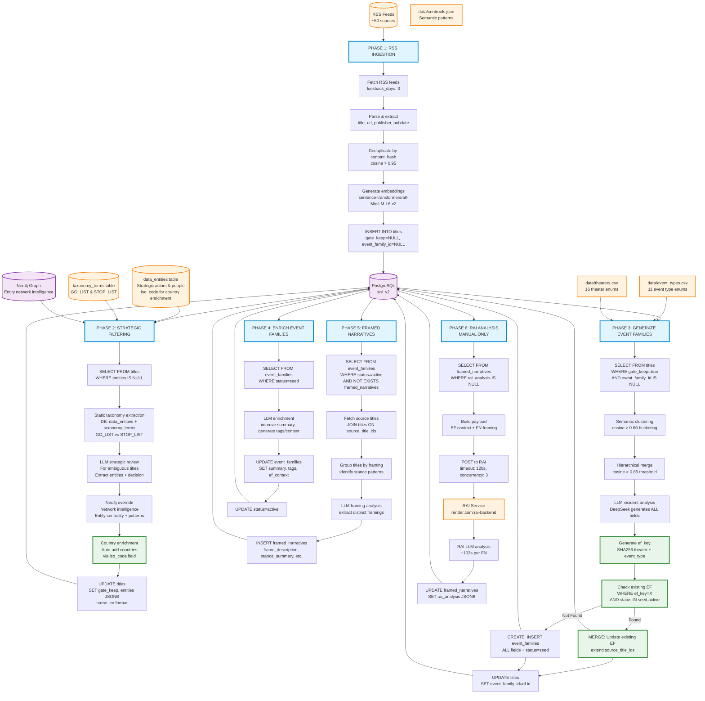
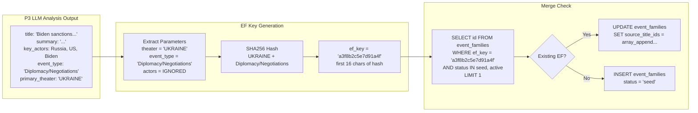
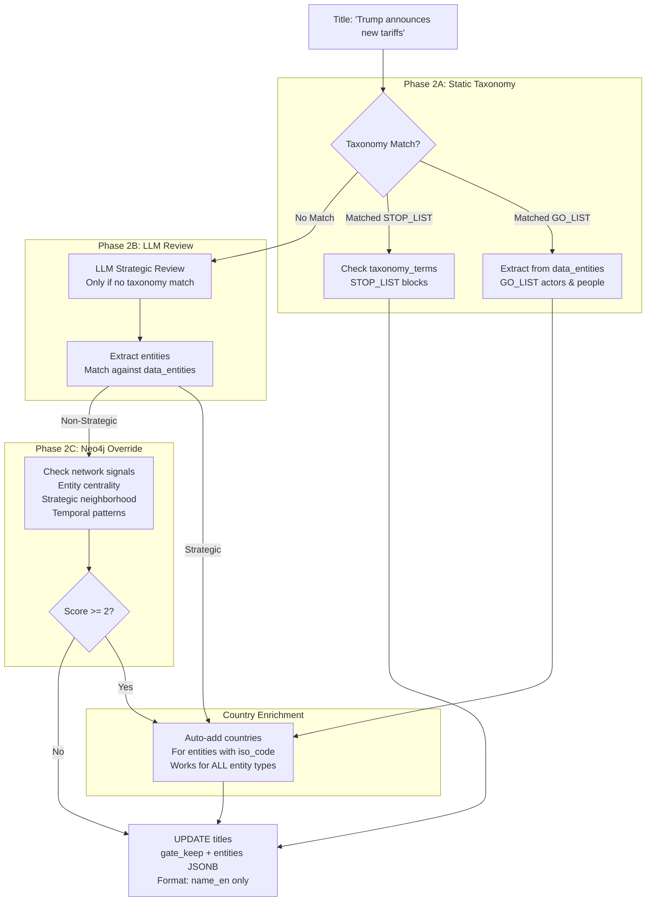
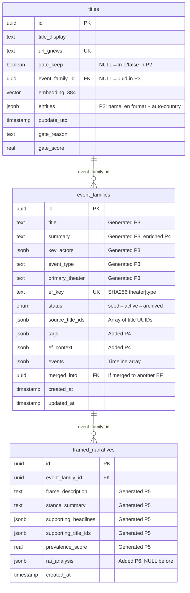
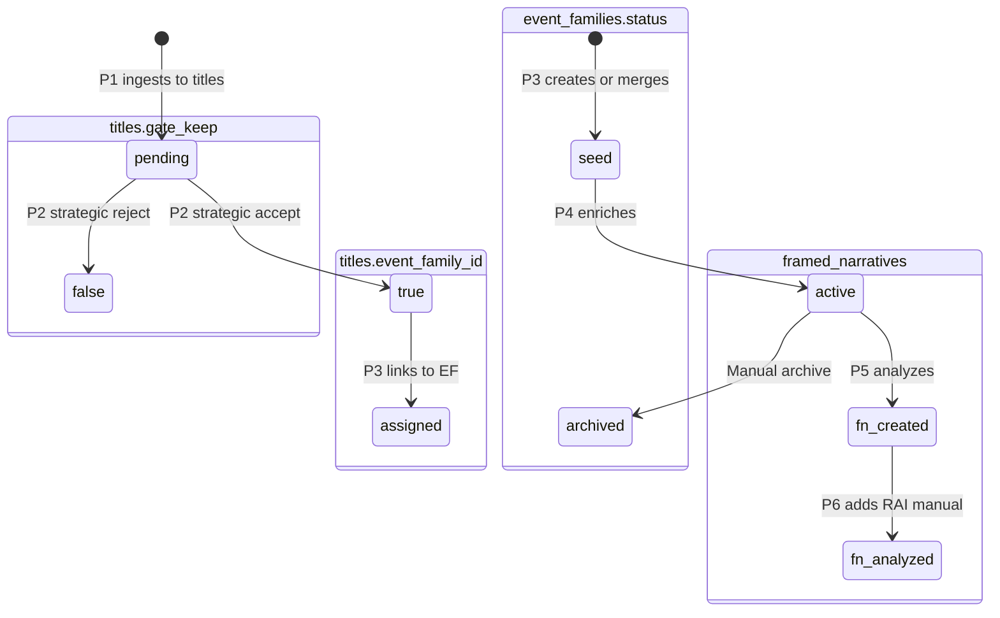

# SNI-v2 Pipeline Data Flow - Verified Against Codebase

## Rendering Instructions

View this diagram:
- **GitHub/GitLab**: Renders automatically in markdown
- **VS Code**: Install "Markdown Preview Mermaid Support" extension
- **Online**: https://mermaid.live - paste code and export as PNG/SVG
- **Figma**: Export SVG from mermaid.live, drag into Figma

---

## Pipeline Architecture



---

## EF Key System (Detailed)

**Critical Design: 2-Parameter Matching to Prevent Fragmentation**



**Why Actors Are Ignored:**
- **Problem**: Using actors in ef_key causes fragmentation. `["Russia", "Ukraine"]` vs `["Russia", "Ukraine", "NATO"]` would create separate EFs
- **Solution**: Only use `theater + event_type`. All incidents in `UKRAINE` with `Diplomacy/Negotiations` merge into same EF
- **Result**: Long-lived saga EFs that absorb related incidents over time

**Code Reference:** `apps/generate/ef_key.py:45-76`

---

## Phase 2: Strategic Filtering Flow (Detailed)

**Three-Phase Approach: Static Taxonomy → LLM Review → Neo4j Override**



**Key Features:**

1. **Database-Backed Vocabularies**: No CSV files, all from `data_entities` and `taxonomy_terms` tables
2. **Entity Naming Consistency**: Always use `name_en` (e.g., "United States" not "US")
3. **Country Auto-Enrichment**:
   - "Donald Trump" detected → adds "United States" (via iso_code=US)
   - "FBI" detected → adds "United States" (via iso_code=US)
   - Works for ALL entity types (PERSON, ORG, Company, etc.)
4. **Neo4j Intelligence**: Network patterns override LLM for borderline cases
5. **LLM Optimization**: Removed "reason" field, reduced from 150 to 80 tokens per request

**Code References:**
- `apps/filter/entity_enrichment.py` - Main orchestration
- `apps/filter/taxonomy_extractor.py` - Static GO/STOP matching
- `apps/filter/country_enrichment.py` - Auto-country via iso_code
- `apps/filter/vocab_loader_db.py` - Database vocabulary loader
- `core/neo4j_sync.py` - Network intelligence

---

## Database Schema



---

## Status Flow



**Key State Transitions:**

1. **titles.gate_keep**: `NULL` (P1) → `true` (P2 accept) / `false` (P2 reject)
2. **titles.event_family_id**: `NULL` (P1-P2) → `<uuid>` (P3 assigns)
3. **event_families.status**: `seed` (P3 creates) → `active` (P4 enriches) → `archived` (manual)
4. **framed_narratives.rai_analysis**: `NULL` (P5 creates) → `<jsonb>` (P6 manual analysis)

---

## Key Merge Fields & Queries

### P1 → P2 Queue
```sql
SELECT * FROM titles
WHERE entities IS NULL
ORDER BY pubdate_utc DESC
```

### P2 → P3 Queue
```sql
SELECT * FROM titles
WHERE gate_keep = true
AND event_family_id IS NULL
ORDER BY pubdate_utc DESC
```

### P3 EF Merge Check
```sql
SELECT id, source_title_ids FROM event_families
WHERE ef_key = :ef_key
AND status IN ('seed', 'active')
LIMIT 1
```

### P3 Title Assignment
```sql
UPDATE titles
SET event_family_id = :ef_id
WHERE id = ANY(:title_ids)
```

### P4 → P5 Queue
```sql
SELECT * FROM event_families
WHERE status = 'seed'
ORDER BY created_at ASC
```

### P5 → P6 Queue
```sql
SELECT ef.*, fn.*
FROM event_families ef
WHERE ef.status = 'active'
AND NOT EXISTS (
    SELECT 1 FROM framed_narratives fn
    WHERE fn.event_family_id = ef.id
)
```

### P6 Queue (Manual Only)
```sql
SELECT fn.*, ef.*
FROM framed_narratives fn
JOIN event_families ef ON fn.event_family_id = ef.id
WHERE fn.rai_analysis IS NULL
AND ef.status IN ('active', 'enriched')
ORDER BY fn.created_at DESC
```

---

## Critical Configuration

```yaml
# Clustering Thresholds
COSINE_THRESHOLD_DEDUP: 0.95   # P1: Near-duplicate detection
COSINE_THRESHOLD_BUCKET: 0.60  # P3: Initial bucketing
COSINE_THRESHOLD_MERGE: 0.85   # P3: Hierarchical merge

# Phase 2: Strategic Filtering
P2_TAXONOMY_SOURCE: database    # data_entities + taxonomy_terms
P2_ENTITY_FORMAT: name_en       # Use full names (not entity_id codes)
P2_COUNTRY_ENRICHMENT: true     # Auto-add countries via iso_code
P2_NEO4J_OVERRIDE: enabled      # Network intelligence
P2_STRATEGIC_SCORE_MIN: 2       # Neo4j multi-signal threshold

# EF Key System (P3)
EF_KEY_ALGORITHM: SHA256        # Hash function
EF_KEY_LENGTH: 16              # First 16 chars of hash
EF_KEY_PARAMS: "theater|type"  # actors IGNORED

# Phase Enables
PHASE_5_FRAMING_ENABLED: true  # ✓ Runs in pipeline
PHASE_6_RAI_ENABLED: false     # ✗ Manual only

# LLM Provider
LLM_PROVIDER: deepseek
LLM_MODEL: deepseek-chat
MAX_TOKENS_PER_REQUEST: 80     # Optimized (no reason field)
DEEPSEEK_API_URL: https://api.deepseek.com/v1

# RAI Integration
RAI_API_URL: https://rai-backend-ldy4.onrender.com/api/v1/analyze
RAI_TIMEOUT_SECONDS: 120       # Extended for ~103s analysis
PHASE_6_CONCURRENCY: 3         # Conservative for external API
```

---

## Pipeline Timing & Concurrency

| Phase | Avg Duration | Concurrency | Timeout | Queue Logic |
|-------|--------------|-------------|---------|-------------|
| P1 | ~2 min | RSS feeds parallel | 10 min | All active feeds |
| P2 | 3-28 min | 5 parallel titles | 30 min | `WHERE gate_keep IS NULL` |
| P3 | Background worker | 4 parallel incidents | N/A | `WHERE gate_keep=true AND ef_id IS NULL` |
| P4 | ~2 sec | 3 parallel EFs | 30 min | `WHERE status='seed'` |
| P5 | TBD | 4 parallel EFs | 20 min | `WHERE status='active' AND no FNs` |
| P6 | **~103 sec/FN** | 3 parallel FNs | 120 sec/req | `WHERE rai_analysis IS NULL` (manual) |

---

## Data Volumes (Typical)

- **P1 Output**: ~500-1000 titles/hour from 50 feeds
- **P2 Accept Rate**: ~5-10% (50-100 strategic titles/hour)
- **P3 EF Creation**: ~5-15 EFs/cycle (many merge into existing)
- **P4 Enrichment**: Processes all new seed EFs (~5-15/cycle)
- **P5 Framing**: ~2-5 FNs per active EF
- **P6 RAI**: Manual only, ~103s per FN

---

## Export & Usage

1. **View in GitHub**: Push this file - renders automatically
2. **VS Code**: Install "Markdown Preview Mermaid Support"
3. **Export PNG/SVG**:
   - Open https://mermaid.live
   - Paste mermaid code block
   - Click "Export" → PNG/SVG/PDF
4. **Import to Figma**:
   - Export as SVG from mermaid.live
   - Drag SVG file into Figma
   - Ungroup (⌘⇧G / Ctrl+Shift+G)
   - Customize styling

---

## Code References

- **P2 Entity Enrichment**: `apps/filter/entity_enrichment.py`
- **P2 Taxonomy Extraction**: `apps/filter/taxonomy_extractor.py`
- **P2 Country Enrichment**: `apps/filter/country_enrichment.py`
- **P2 Vocab Loader**: `apps/filter/vocab_loader_db.py`
- **EF Key Generation**: `apps/generate/ef_key.py:45-76`
- **EF Upsert Logic**: `apps/generate/database.py:223-290`
- **P3 Incident Processing**: `apps/generate/incident_processor.py:43-188`
- **P4 Enrichment**: `apps/enrich/processor.py:130-170`
- **P5 Framing**: `apps/generate/framing_processor.py:28-90`
- **P6 RAI**: `apps/generate/rai_processor.py:30-150`
- **Neo4j Sync**: `core/neo4j_sync.py`
