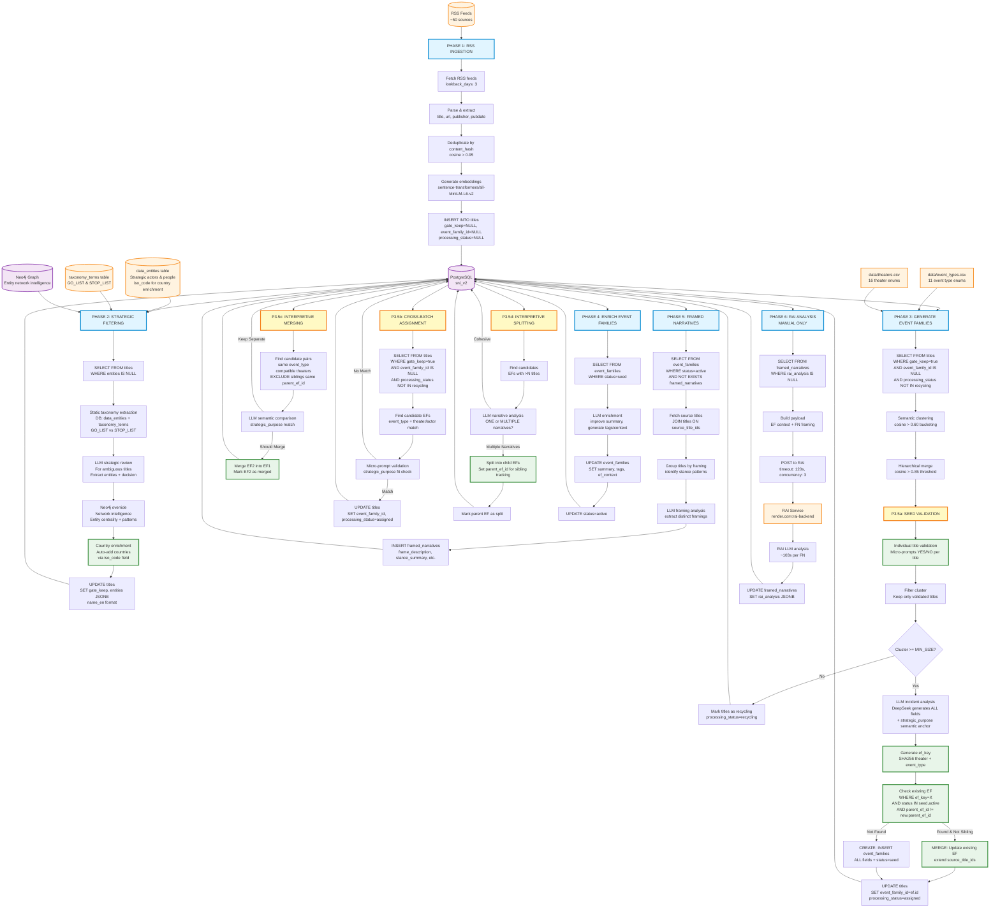
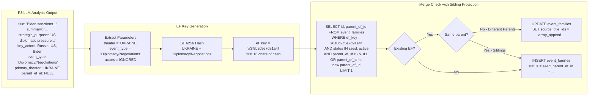
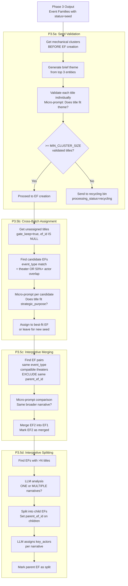
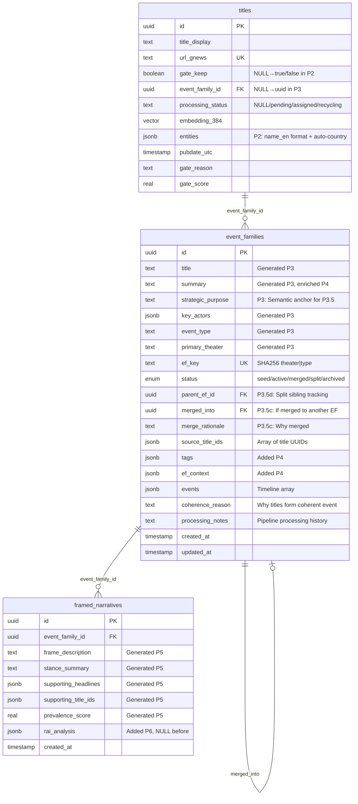
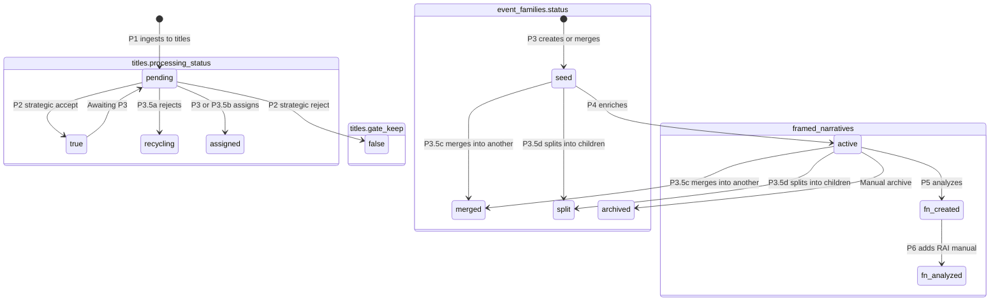

# SNI-v2 Pipeline Data Flow - Current Implementation

## Rendering Instructions

View this diagram:
- **GitHub/GitLab**: Renders automatically in markdown
- **VS Code**: Install "Markdown Preview Mermaid Support" extension
- **Online**: https://mermaid.live - paste code and export as PNG/SVG
- **Figma**: Export SVG from mermaid.live, drag into Figma

---

## Pipeline Architecture



---

## EF Key System with Sibling Protection

**Critical Design: 2-Parameter Matching + Sibling Exclusion**



**Why Actors Are Ignored:**
- **Problem**: Using actors in ef_key causes fragmentation
- **Solution**: Only use `theater + event_type`
- **Result**: Long-lived saga EFs that absorb related incidents over time

**Sibling Protection:**
- P3.5d splits create child EFs with `parent_ef_id` set
- Siblings share same `parent_ef_id` and will NOT merge together
- Prevents intentionally separated narratives from re-merging
- Allows cross-family merges when semantically appropriate

**Code Reference:** `apps/generate/ef_key.py`, `apps/generate/database.py:246-264`

---

## Phase 3.5: Intelligence Layer (Detailed)

**Post-Mechanical Processing: LLM-Powered Refinement**



**Key Features:**

- **P3.5a (Seed Validation)**: Prevents noise from entering EFs via individual title validation
- **P3.5b (Cross-Batch Assignment)**: Continuously assigns new titles to existing EFs using strategic_purpose
- **P3.5c (Interpretive Merging)**: Merges semantically similar EFs beyond mechanical ef_key matching
- **P3.5d (Interpretive Splitting)**: Splits mixed-narrative EFs into coherent sub-narratives with sibling tracking

**Micro-Prompts:**
- Temperature: 0.0
- Max tokens: 10 (YES/NO only)
- Fast, cheap validation without explanation

**Strategic Purpose:**
- One-sentence semantic anchor generated by Phase 3 LLM
- Used across all Phase 3.5 components for thematic validation
- Enables consistent intelligence operations

**Code References:**
- `apps/generate/seed_validator.py` - P3.5a implementation
- `apps/generate/thematic_validator.py` - P3.5b implementation
- `apps/generate/ef_merger.py` - P3.5c implementation
- `apps/generate/ef_splitter.py` - P3.5d implementation
- `apps/generate/p35_pipeline.py` - Complete orchestration

---

## Database Schema



**Key Schema Changes (v2.1):**
- `titles.processing_status`: Tracks title lifecycle (pending/assigned/recycling)
- `event_families.strategic_purpose`: Semantic anchor for Phase 3.5
- `event_families.parent_ef_id`: Sibling tracking for P3.5d splits
- `event_families.status`: Now includes 'split' for parent EFs
- Removed: `confidence_score` (unused)

---

## Status Flow



**Key State Transitions:**

1. **titles.gate_keep**: `NULL` (P1) → `true` (P2 accept) / `false` (P2 reject)
2. **titles.processing_status**: `NULL` → `pending` → `assigned` (P3/P3.5b) / `recycling` (P3.5a)
3. **event_families.status**: `seed` (P3) → `active` (P4) / `merged` (P3.5c) / `split` (P3.5d) → `archived` (manual)
4. **framed_narratives.rai_analysis**: `NULL` (P5 creates) → `<jsonb>` (P6 manual analysis)

---

## Key Queries

### P1 → P2 Queue
```sql
SELECT * FROM titles
WHERE entities IS NULL
ORDER BY pubdate_utc DESC
```

### P2 → P3 Queue
```sql
SELECT * FROM titles
WHERE gate_keep = true
AND event_family_id IS NULL
AND processing_status NOT IN ('recycling')
ORDER BY pubdate_utc DESC
```

### P3 EF Merge Check (with Sibling Protection)
```sql
SELECT id, parent_ef_id, source_title_ids FROM event_families
WHERE ef_key = :ef_key
AND status IN ('seed', 'active')
AND (parent_ef_id IS NULL OR parent_ef_id != :new_parent_ef_id OR :new_parent_ef_id IS NULL)
LIMIT 1
```

### P3 Title Assignment
```sql
UPDATE titles
SET event_family_id = :ef_id,
    processing_status = 'assigned'
WHERE id = ANY(:title_ids)
```

### P3.5a Recycling Bin
```sql
UPDATE titles
SET processing_status = 'recycling'
WHERE id = ANY(:rejected_title_ids)
```

### P3.5b Cross-Batch Queue
```sql
SELECT * FROM titles
WHERE gate_keep = true
AND event_family_id IS NULL
AND processing_status NOT IN ('recycling', 'assigned')
ORDER BY pubdate_utc DESC
```

### P3.5c Merge Candidates (Exclude Siblings)
```sql
SELECT ef1.id, ef2.id, ef1.strategic_purpose, ef2.strategic_purpose
FROM event_families ef1, event_families ef2
WHERE ef1.event_type = ef2.event_type
AND ef1.status IN ('seed', 'active')
AND ef2.status IN ('seed', 'active')
AND ef1.id < ef2.id
AND (ef1.parent_ef_id IS NULL OR ef2.parent_ef_id IS NULL OR ef1.parent_ef_id != ef2.parent_ef_id)
```

### P3.5d Split Candidates
```sql
SELECT * FROM event_families
WHERE status IN ('seed', 'active')
AND ARRAY_LENGTH(source_title_ids, 1) > :min_titles_for_split
ORDER BY ARRAY_LENGTH(source_title_ids, 1) DESC
```

### P4 → P5 Queue
```sql
SELECT * FROM event_families
WHERE status = 'seed'
ORDER BY created_at ASC
```

---

## Critical Configuration

```yaml
# Clustering Thresholds
COSINE_THRESHOLD_DEDUP: 0.95   # P1: Near-duplicate detection
COSINE_THRESHOLD_BUCKET: 0.60  # P3: Initial bucketing
COSINE_THRESHOLD_MERGE: 0.85   # P3: Hierarchical merge

# Phase 2: Strategic Filtering
P2_TAXONOMY_SOURCE: database    # data_entities + taxonomy_terms
P2_ENTITY_FORMAT: name_en       # Use full names (not entity_id codes)
P2_COUNTRY_ENRICHMENT: true     # Auto-add countries via iso_code
P2_NEO4J_OVERRIDE: enabled      # Network intelligence
P2_STRATEGIC_SCORE_MIN: 2       # Neo4j multi-signal threshold

# Phase 3: EF Generation
EF_KEY_ALGORITHM: SHA256        # Hash function
EF_KEY_LENGTH: 16              # First 16 chars of hash
EF_KEY_PARAMS: "theater|type"  # actors IGNORED

# Phase 3.5: Intelligence Layer
P35A_ENABLED: true             # Seed validation
P35A_MIN_CLUSTER_SIZE: 3       # Minimum validated titles
P35A_VALIDATION_TEMPERATURE: 0.0
P35A_VALIDATION_MAX_TOKENS: 10

P35B_ENABLED: true             # Cross-batch assignment
P35B_ASSIGNMENT_TEMPERATURE: 0.0
P35B_ASSIGNMENT_MAX_TOKENS: 10

P35C_ENABLED: true             # Interpretive merging
P35C_MERGE_TEMPERATURE: 0.0
P35C_MERGE_MAX_TOKENS: 10
P35C_MAX_PAIRS_PER_CYCLE: 20

P35D_ENABLED: true             # Interpretive splitting
P35D_MIN_TITLES_FOR_SPLIT: 3
P35D_SPLIT_TEMPERATURE: 0.3
P35D_SPLIT_MAX_TOKENS: 4000
P35D_MAX_EFS_PER_CYCLE: 50

# Phase Enables
PHASE_4_ENRICHMENT_ENABLED: true
PHASE_5_FRAMING_ENABLED: true
PHASE_6_RAI_ENABLED: false     # Manual only

# LLM Provider
LLM_PROVIDER: deepseek
LLM_MODEL: deepseek-chat
DEEPSEEK_API_URL: https://api.deepseek.com/v1

# RAI Integration
RAI_API_URL: https://rai-backend-ldy4.onrender.com/api/v1/analyze
RAI_TIMEOUT_SECONDS: 120
PHASE_6_CONCURRENCY: 3
```

---

## Code References

### Phase 2: Strategic Filtering
- `apps/filter/entity_enrichment.py` - Main orchestration
- `apps/filter/taxonomy_extractor.py` - Static GO/STOP matching
- `apps/filter/country_enrichment.py` - Auto-country via iso_code
- `apps/filter/vocab_loader_db.py` - Database vocabulary loader
- `core/neo4j_sync.py` - Network intelligence

### Phase 3: EF Generation
- `apps/generate/ef_key.py` - ef_key generation (theater + type)
- `apps/generate/database.py` - EF upsert with sibling protection
- `apps/generate/incident_processor.py` - Incident clustering & processing
- `apps/generate/reduce_assembler.py` - REDUCE phase EF assembly
- `apps/generate/theater_inference.py` - Mechanical theater inference

### Phase 3.5: Intelligence Layer
- `apps/generate/seed_validator.py` - P3.5a: Individual title validation
- `apps/generate/thematic_validator.py` - P3.5b: Cross-batch assignment
- `apps/generate/ef_merger.py` - P3.5c: Interpretive EF merging
- `apps/generate/ef_splitter.py` - P3.5d: Interpretive EF splitting
- `apps/generate/p35_pipeline.py` - Complete P3.5 orchestration

### Phase 4-6
- `apps/enrich/processor.py` - P4: EF enrichment
- `apps/generate/framing_processor.py` - P5: Framed narratives
- `apps/generate/rai_processor.py` - P6: RAI analysis (manual)

### Core Infrastructure
- `core/config.py` - All Phase 3.5 configuration
- `core/database.py` - Database session management
- `core/llm_client.py` - DeepSeek LLM integration
