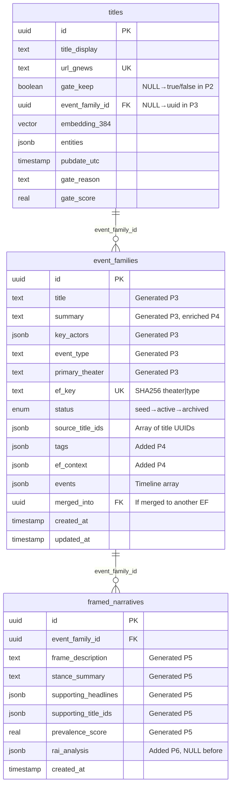

# SNI-v2 Pipeline Data Flow - Verified Against Codebase

## Rendering Instructions

View this diagram:
- **GitHub/GitLab**: Renders automatically in markdown
- **VS Code**: Install "Markdown Preview Mermaid Support" extension
- **Online**: https://mermaid.live - paste code and export as PNG/SVG
- **Figma**: Export SVG from mermaid.live, drag into Figma

---

## Pipeline Architecture

```mermaid
flowchart TD
    %% External Data Sources
    RSS[(RSS Feeds<br/>~50 sources)]
    ACTORS[data/actors.csv<br/>Strategic actors]
    GO_PEOPLE[data/go_people.csv<br/>Strategic people]
    STOP_CULTURE[data/stop_culture.csv<br/>Blocked topics]
    CENTROIDS[data/centroids.json<br/>Semantic patterns]
    EVENT_TYPES[data/event_types.csv<br/>11 event type enums]
    THEATERS[data/theaters.csv<br/>16 theater enums]
    RAI_APP[RAI Service<br/>render.com:rai-backend]

    %% Database
    DB[(PostgreSQL<br/>sni_v2)]

    %% Phase 1: RSS Ingestion
    P1_START[PHASE 1: RSS INGESTION]
    P1_FETCH[Fetch RSS feeds<br/>lookback_days: 3]
    P1_PARSE[Parse & extract<br/>title, url, publisher, pubdate]
    P1_DEDUP[Deduplicate by content_hash<br/>cosine > 0.95]
    P1_EMBED[Generate embeddings<br/>sentence-transformers/all-MiniLM-L6-v2]
    P1_STORE[INSERT INTO titles<br/>gate_keep=NULL, event_family_id=NULL]

    %% Phase 2: Strategic Filtering
    P2_START[PHASE 2: STRATEGIC FILTERING]
    P2_LOAD[SELECT FROM titles<br/>WHERE gate_keep IS NULL]
    P2_SEMANTIC[Semantic gate<br/>cosine vs centroids.json]
    P2_LEXICAL[Multi-vocab matching<br/>GO: actors.csv, go_people.csv<br/>STOP: stop_culture.csv]
    P2_LLM[LLM hybrid validation<br/>DeepSeek confirmation]
    P2_ACCEPT[UPDATE titles<br/>SET gate_keep=true]
    P2_REJECT[UPDATE titles<br/>SET gate_keep=false, gate_reason]

    %% Phase 3: Event Family Generation
    P3_START[PHASE 3: GENERATE EVENT FAMILIES]
    P3_QUEUE[SELECT FROM titles<br/>WHERE gate_keep=true<br/>AND event_family_id IS NULL]
    P3_BUCKET[Semantic clustering<br/>cosine > 0.60 bucketing]
    P3_CLUSTER[Hierarchical merge<br/>cosine > 0.85 threshold]
    P3_LLM[LLM incident analysis<br/>DeepSeek generates ALL fields]
    P3_EF_KEY[Generate ef_key<br/>SHA256 theater|event_type]
    P3_CHECK[Check existing EF<br/>WHERE ef_key=X<br/>AND status IN seed,active]
    P3_MERGE[MERGE: Update existing EF<br/>extend source_title_ids]
    P3_CREATE[CREATE: INSERT event_families<br/>ALL fields + status=seed]
    P3_LINK[UPDATE titles<br/>SET event_family_id=ef.id]

    %% Phase 4: Enrichment
    P4_START[PHASE 4: ENRICH EVENT FAMILIES]
    P4_QUEUE[SELECT FROM event_families<br/>WHERE status=seed]
    P4_LLM[LLM enrichment<br/>improve summary, generate tags/context]
    P4_UPDATE[UPDATE event_families<br/>SET summary, tags, ef_context]
    P4_STATUS[UPDATE status=active]

    %% Phase 5: Framed Narratives
    P5_START[PHASE 5: FRAMED NARRATIVES]
    P5_QUEUE[SELECT FROM event_families<br/>WHERE status=active<br/>AND NOT EXISTS framed_narratives]
    P5_FETCH_TITLES[Fetch source titles<br/>JOIN titles ON source_title_ids]
    P5_ANALYZE[Group titles by framing<br/>identify stance patterns]
    P5_LLM[LLM framing analysis<br/>extract distinct framings]
    P5_CREATE[INSERT framed_narratives<br/>frame_description, stance_summary, etc.]

    %% Phase 6: RAI Analysis
    P6_START[PHASE 6: RAI ANALYSIS<br/>MANUAL ONLY]
    P6_QUEUE[SELECT FROM framed_narratives<br/>WHERE rai_analysis IS NULL]
    P6_PAYLOAD[Build payload<br/>EF context + FN framing]
    P6_HTTP[POST to RAI<br/>timeout: 120s, concurrency: 3]
    P6_ANALYZE[RAI LLM analysis<br/>~103s per FN]
    P6_STORE[UPDATE framed_narratives<br/>SET rai_analysis JSONB]

    %% Flow connections
    RSS --> P1_START
    P1_START --> P1_FETCH --> P1_PARSE --> P1_DEDUP --> P1_EMBED --> P1_STORE --> DB

    DB --> P2_START
    ACTORS --> P2_START
    GO_PEOPLE --> P2_START
    STOP_CULTURE --> P2_START
    CENTROIDS --> P2_START
    P2_START --> P2_LOAD --> P2_SEMANTIC --> P2_LEXICAL --> P2_LLM
    P2_LLM --> P2_ACCEPT --> DB
    P2_LLM --> P2_REJECT --> DB

    DB --> P3_START
    EVENT_TYPES --> P3_START
    THEATERS --> P3_START
    P3_START --> P3_QUEUE --> P3_BUCKET --> P3_CLUSTER --> P3_LLM --> P3_EF_KEY --> P3_CHECK
    P3_CHECK -->|Found| P3_MERGE --> DB
    P3_CHECK -->|Not Found| P3_CREATE --> DB
    P3_MERGE --> P3_LINK --> DB
    P3_CREATE --> P3_LINK

    DB --> P4_START
    P4_START --> P4_QUEUE --> P4_LLM --> P4_UPDATE --> P4_STATUS --> DB

    DB --> P5_START
    P5_START --> P5_QUEUE --> P5_FETCH_TITLES --> P5_ANALYZE --> P5_LLM --> P5_CREATE --> DB

    DB --> P6_START
    P6_START --> P6_QUEUE --> P6_PAYLOAD --> P6_HTTP --> RAI_APP
    RAI_APP --> P6_ANALYZE --> P6_STORE --> DB

    %% Styling
    classDef phaseClass fill:#e1f5ff,stroke:#0288d1,stroke-width:3px
    classDef dataSource fill:#fff3e0,stroke:#f57c00,stroke-width:2px
    classDef dbClass fill:#f3e5f5,stroke:#7b1fa2,stroke-width:2px
    classDef keyProcess fill:#e8f5e9,stroke:#388e3c,stroke-width:3px

    class P1_START,P2_START,P3_START,P4_START,P5_START,P6_START phaseClass
    class RSS,ACTORS,GO_PEOPLE,STOP_CULTURE,CENTROIDS,EVENT_TYPES,THEATERS,RAI_APP dataSource
    class DB dbClass
    class P3_EF_KEY,P3_CHECK,P3_MERGE keyProcess
```

---

## EF Key System (Detailed)

**Critical Design: 2-Parameter Matching to Prevent Fragmentation**

```mermaid
flowchart LR
    subgraph "P3 LLM Analysis Output"
        LLM_OUT[title: 'Biden sanctions...'<br/>summary: '...'<br/>key_actors: Russia, US, Biden<br/>event_type: 'Diplomacy/Negotiations'<br/>primary_theater: 'UKRAINE']
    end

    subgraph "EF Key Generation"
        EXTRACT[Extract Parameters<br/>theater = 'UKRAINE'<br/>event_type = 'Diplomacy/Negotiations'<br/>actors = IGNORED]
        HASH[SHA256 Hash<br/>'UKRAINE|Diplomacy/Negotiations']
        KEY[ef_key = 'a3f8b2c5e7d91a4f'<br/>first 16 chars of hash]
    end

    subgraph "Merge Check"
        QUERY[SELECT id FROM event_families<br/>WHERE ef_key = 'a3f8b2c5e7d91a4f'<br/>AND status IN seed, active<br/>LIMIT 1]
        FOUND{Existing EF?}
        MERGE[UPDATE event_families<br/>SET source_title_ids = array_append...]
        CREATE[INSERT event_families<br/>status = 'seed']
    end

    LLM_OUT --> EXTRACT --> HASH --> KEY --> QUERY --> FOUND
    FOUND -->|Yes| MERGE
    FOUND -->|No| CREATE
```

**Why Actors Are Ignored:**
- **Problem**: Using actors in ef_key causes fragmentation. `["Russia", "Ukraine"]` vs `["Russia", "Ukraine", "NATO"]` would create separate EFs
- **Solution**: Only use `theater + event_type`. All incidents in `UKRAINE` with `Diplomacy/Negotiations` merge into same EF
- **Result**: Long-lived saga EFs that absorb related incidents over time

**Code Reference:** `apps/generate/ef_key.py:45-76`

---

## Database Schema



---

## Status Flow


**Key State Transitions:**

1. **titles.gate_keep**: `NULL` (P1) → `true` (P2 accept) / `false` (P2 reject)
2. **titles.event_family_id**: `NULL` (P1-P2) → `<uuid>` (P3 assigns)
3. **event_families.status**: `seed` (P3 creates) → `active` (P4 enriches) → `archived` (manual)
4. **framed_narratives.rai_analysis**: `NULL` (P5 creates) → `<jsonb>` (P6 manual analysis)

---

## Key Merge Fields & Queries

### P1 → P2 Queue
```sql
SELECT * FROM titles
WHERE gate_keep IS NULL
ORDER BY pubdate_utc DESC
```

### P2 → P3 Queue
```sql
SELECT * FROM titles
WHERE gate_keep = true
AND event_family_id IS NULL
ORDER BY pubdate_utc DESC
```

### P3 EF Merge Check
```sql
SELECT id, source_title_ids FROM event_families
WHERE ef_key = :ef_key
AND status IN ('seed', 'active')
LIMIT 1
```

### P3 Title Assignment
```sql
UPDATE titles
SET event_family_id = :ef_id
WHERE id = ANY(:title_ids)
```

### P4 → P5 Queue
```sql
SELECT * FROM event_families
WHERE status = 'seed'
ORDER BY created_at ASC
```

### P5 → P6 Queue
```sql
SELECT ef.*, fn.*
FROM event_families ef
WHERE ef.status = 'active'
AND NOT EXISTS (
    SELECT 1 FROM framed_narratives fn
    WHERE fn.event_family_id = ef.id
)
```

### P6 Queue (Manual Only)
```sql
SELECT fn.*, ef.*
FROM framed_narratives fn
JOIN event_families ef ON fn.event_family_id = ef.id
WHERE fn.rai_analysis IS NULL
AND ef.status IN ('active', 'enriched')
ORDER BY fn.created_at DESC
```

---

## Critical Configuration

```yaml
# Clustering Thresholds
COSINE_THRESHOLD_DEDUP: 0.95   # P1: Near-duplicate detection
COSINE_THRESHOLD_GATE: 0.70    # P2: Semantic gate threshold
COSINE_THRESHOLD_BUCKET: 0.60  # P3: Initial bucketing
COSINE_THRESHOLD_MERGE: 0.85   # P3: Hierarchical merge

# EF Key System (P3)
EF_KEY_ALGORITHM: SHA256        # Hash function
EF_KEY_LENGTH: 16              # First 16 chars of hash
EF_KEY_PARAMS: "theater|type"  # actors IGNORED

# Phase Enables
PHASE_5_FRAMING_ENABLED: true  # ✓ Runs in pipeline
PHASE_6_RAI_ENABLED: false     # ✗ Manual only

# LLM Provider
LLM_PROVIDER: deepseek
LLM_MODEL: deepseek-chat
MAX_TOKENS_PER_REQUEST: 4000
DEEPSEEK_API_URL: https://api.deepseek.com/v1

# RAI Integration
RAI_API_URL: https://rai-backend-ldy4.onrender.com/api/v1/analyze
RAI_TIMEOUT_SECONDS: 120       # Extended for ~103s analysis
PHASE_6_CONCURRENCY: 3         # Conservative for external API
```

---

## Pipeline Timing & Concurrency

| Phase | Avg Duration | Concurrency | Timeout | Queue Logic |
|-------|--------------|-------------|---------|-------------|
| P1 | ~2 min | RSS feeds parallel | 10 min | All active feeds |
| P2 | 3-28 min | 5 parallel titles | 30 min | `WHERE gate_keep IS NULL` |
| P3 | Background worker | 4 parallel incidents | N/A | `WHERE gate_keep=true AND ef_id IS NULL` |
| P4 | ~2 sec | 3 parallel EFs | 30 min | `WHERE status='seed'` |
| P5 | TBD | 4 parallel EFs | 20 min | `WHERE status='active' AND no FNs` |
| P6 | **~103 sec/FN** | 3 parallel FNs | 120 sec/req | `WHERE rai_analysis IS NULL` (manual) |

---

## Data Volumes (Typical)

- **P1 Output**: ~500-1000 titles/hour from 50 feeds
- **P2 Accept Rate**: ~5-10% (50-100 strategic titles/hour)
- **P3 EF Creation**: ~5-15 EFs/cycle (many merge into existing)
- **P4 Enrichment**: Processes all new seed EFs (~5-15/cycle)
- **P5 Framing**: ~2-5 FNs per active EF
- **P6 RAI**: Manual only, ~103s per FN

---

## Export & Usage

1. **View in GitHub**: Push this file - renders automatically
2. **VS Code**: Install "Markdown Preview Mermaid Support"
3. **Export PNG/SVG**:
   - Open https://mermaid.live
   - Paste mermaid code block
   - Click "Export" → PNG/SVG/PDF
4. **Import to Figma**:
   - Export as SVG from mermaid.live
   - Drag SVG file into Figma
   - Ungroup (⌘⇧G / Ctrl+Shift+G)
   - Customize styling

---

## Code References

- **EF Key Generation**: `apps/generate/ef_key.py:45-76`
- **EF Upsert Logic**: `apps/generate/database.py:223-290`
- **P3 Incident Processing**: `apps/generate/incident_processor.py:43-188`
- **P4 Enrichment**: `apps/enrich/processor.py:130-170`
- **P5 Framing**: `apps/generate/framing_processor.py:28-90`
- **P6 RAI**: `apps/generate/rai_processor.py:30-150`
