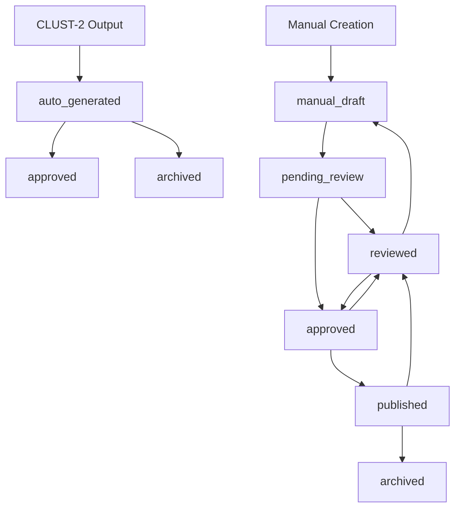

# Manual Parent Narrative Curation System

## Overview

The Manual Parent Narrative Curation System extends the existing SNI Strategic Narrative Intelligence platform with comprehensive manual curation capabilities. It enables editorial teams to create strategic parent narratives that span multiple CLUST-1/CLUST-2 cluster outputs, providing human oversight and strategic narrative management.

## Key Features

- **Manual Parent Narrative Creation**: Create strategic parent narratives that group multiple automated cluster outputs
- **Editorial Workflow Management**: Complete draft → review → publish workflow with role-based access
- **Cluster Grouping**: Manual grouping of CLUST-1/CLUST-2 clusters into cohesive strategic narratives
- **Comprehensive Audit Trail**: Full logging of all curation actions and workflow changes
- **Dashboard Views**: Real-time overview of curation workflow and pending items
- **API Integration**: RESTful API endpoints for frontend integration

## Architecture

### Database Schema Enhancement

The system extends the existing `narratives` table with curation-specific fields:

- **Workflow Status**: `curation_status` enum (draft → pending_review → approved → published)
- **Source Tracking**: `curation_source` enum (auto vs manual generation)
- **Role Assignment**: `curator_id`, `reviewer_id` for workflow management
- **Editorial Control**: `editorial_priority`, `review_deadline`, `published_at`
- **Cluster Grouping**: `manual_cluster_ids` JSONB array for cluster associations
- **Audit Fields**: `curation_notes` JSONB array for workflow history

### Core Components

```
etl_pipeline/core/curation/
├── manual_narrative_manager.py    # Core business logic
├── README.md                      # This documentation
└── __init__.py

etl_pipeline/api/
├── curation_endpoints.py          # FastAPI REST endpoints

database_migrations/
├── 027_manual_parent_narrative_curation.sql  # Schema migration

tests/
├── test_manual_curation_integration.py       # Integration tests
```

## Usage Examples

### 1. Create Manual Parent Narrative

```python
from etl_pipeline.core.curation.manual_narrative_manager import ManualNarrativeManager

manager = ManualNarrativeManager()

# Create strategic parent narrative
parent_uuid, parent_id = manager.create_manual_parent(
    title="Russia-Ukraine Energy Infrastructure Campaign",
    summary="Strategic narrative covering coordinated attacks on Ukrainian energy infrastructure...",
    curator_id="analyst_001",
    cluster_ids=["clust1_energy_001", "clust2_infrastructure_045", "clust1_ukraine_012"],
    editorial_priority=1  # High priority
)

print(f"Created parent narrative: {parent_id} ({parent_uuid})")
```

### 2. Assign Child Narratives

```python
# Assign existing child narratives to manual parent
child_uuids = [
    "550e8400-e29b-41d4-a716-446655440001",
    "550e8400-e29b-41d4-a716-446655440002",
    "550e8400-e29b-41d4-a716-446655440003"
]

assigned_count = manager.assign_children_to_parent(
    parent_uuid=parent_uuid,
    child_uuids=child_uuids,
    curator_id="analyst_001",
    rationale="Grouping related energy infrastructure narratives for strategic coherence"
)

print(f"Assigned {assigned_count} child narratives")
```

### 3. Workflow Management

```python
# Progress through editorial workflow
manager.update_curation_status(
    narrative_uuid=parent_uuid,
    new_status="pending_review",
    actor_id="analyst_001",
    notes="Ready for editorial review - comprehensive strategic analysis complete"
)

# Editorial review approval
manager.update_curation_status(
    narrative_uuid=parent_uuid,
    new_status="approved",
    actor_id="editor_001", 
    notes="Approved with minor editorial adjustments"
)

# Publication
manager.update_curation_status(
    narrative_uuid=parent_uuid,
    new_status="published",
    actor_id="publisher_001",
    notes="Published to production dashboard"
)
```

### 4. Dashboard Data

```python
# Get curation dashboard for specific curator
dashboard_data = manager.get_curation_dashboard(
    curator_id="analyst_001",
    status_filter=["manual_draft", "pending_review"],
    limit=50
)

for item in dashboard_data:
    print(f"{item['narrative_id']}: {item['title']} - {item['curation_status']}")
    if item['is_overdue']:
        print(f"  ⚠️  OVERDUE: {item['review_deadline']}")
```

### 5. Pending Reviews

```python
# Get items needing review (sorted by urgency)
pending_reviews = manager.get_pending_reviews(reviewer_id="editor_001")

for review in pending_reviews:
    urgency = "🔥" if review['review_urgency'] >= 4 else "📋"
    print(f"{urgency} {review['narrative_id']}: {review['title']}")
    print(f"   Priority: {review['editorial_priority']}, Due: {review['days_until_deadline']} days")
```

## API Endpoints

### Core Operations

- `POST /curation/parent` - Create manual parent narrative
- `POST /curation/assign-children` - Assign children to parent
- `PUT /curation/status` - Update curation status
- `POST /curation/cluster-group` - Create cluster grouping

### Dashboard & Monitoring

- `GET /curation/dashboard` - Curation workflow dashboard
- `GET /curation/pending-reviews` - Items needing review
- `GET /curation/validate` - Workflow integrity validation
- `GET /curation/health` - System health check

### Example API Usage

```bash
# Create manual parent narrative
curl -X POST "http://localhost:8000/curation/parent" \
  -H "Content-Type: application/json" \
  -d '{
    "title": "Strategic Disinformation Campaign Analysis", 
    "summary": "Comprehensive analysis of coordinated disinformation efforts...",
    "curator_id": "analyst_002",
    "cluster_ids": ["clust1_001", "clust2_045"],
    "editorial_priority": 2
  }'

# Get curation dashboard
curl "http://localhost:8000/curation/dashboard?curator_id=analyst_002&limit=20"

# Update status
curl -X PUT "http://localhost:8000/curation/status" \
  -H "Content-Type: application/json" \
  -d '{
    "narrative_uuid": "550e8400-e29b-41d4-a716-446655440000",
    "new_status": "pending_review",
    "actor_id": "analyst_002",
    "notes": "Ready for editorial review"
  }'
```

## Integration with Existing Pipeline

### CLUST-2 Integration

The manual curation system seamlessly integrates with existing CLUST-2 output:

```python
# In CLUST-2 pipeline (clust2_interpretive_clustering.py)
from etl_pipeline.core.curation.manual_narrative_manager import ManualNarrativeManager

# After CLUST-2 processing, mark auto-generated narratives
manager = ManualNarrativeManager()
for narrative_uuid in newly_created_narratives:
    manager.update_curation_status(
        narrative_uuid=narrative_uuid,
        new_status="auto_generated", 
        actor_id="clust2_pipeline"
    )
```

### Database Compatibility

- **Backward Compatible**: All existing narratives continue to work
- **Default Values**: Auto-generated content has appropriate defaults
- **Indexes**: Performance-optimized for both auto and manual workflows
- **Foreign Keys**: Maintains referential integrity with CASCADE deletes

### Workflow States



## Deployment

### 1. Database Migration

```bash
# Apply schema migration
psql narrative_intelligence -f database_migrations/027_manual_parent_narrative_curation.sql
```

### 2. Update Application

```python
# Add to main FastAPI app
from etl_pipeline.api.curation_endpoints import curation_router

app.include_router(curation_router, prefix="/api/v1")
```

### 3. Environment Setup

```bash
# Install additional dependencies (if any)
pip install -r requirements.txt

# Run integration tests
python -m pytest tests/test_manual_curation_integration.py -v
```

### 4. Validation

```python
# Validate deployment
from etl_pipeline.core.curation.manual_narrative_manager import ManualNarrativeManager

manager = ManualNarrativeManager()
validation = manager.validate_curation_workflow()
print(f"Deployment status: {validation['overall_status']}")
```

## Performance Considerations

### Database Indexes

The migration includes comprehensive indexing for:
- **Workflow queries**: `idx_narratives_curation_status`, `idx_narratives_curation_workflow`
- **Dashboard views**: `idx_narratives_manual_parents`, `idx_narratives_pending_review`
- **JSONB fields**: GIN indexes for `curation_notes`, `manual_cluster_ids`
- **Audit trail**: Indexes on `narrative_curation_log` for efficient history queries

### Materialized Views

- **Curation Dashboard**: Pre-computed for sub-second response times
- **Pending Reviews**: Optimized urgency scoring and deadline calculations
- **Auto-refresh**: Triggers maintain view consistency

### Scalability

- **Batch Operations**: Support for bulk child assignment and status updates
- **Connection Pooling**: Efficient database connection management
- **Async Support**: Ready for async/await patterns in FastAPI

## Security & Access Control

### Role-Based Workflow

- **Curators**: Create and edit manual narratives
- **Reviewers**: Approve/reject narratives for publication  
- **Publishers**: Move approved content to production
- **Administrators**: Full system access and validation

### Audit Trail

Every action is logged with:
- **Actor identification**: Who performed the action
- **Timestamp**: When it occurred
- **State changes**: Before/after values
- **Rationale**: Why the action was taken
- **Session tracking**: Related actions grouped together

### Data Validation

- **Workflow constraints**: Invalid status transitions blocked
- **Foreign key integrity**: Parent-child relationships validated
- **Schema validation**: JSONB fields conform to expected structure
- **Business rules**: Editorial priorities and deadlines enforced

## Monitoring & Maintenance

### Health Checks

```python
# Regular health monitoring
health = manager.validate_curation_workflow()
if health['overall_status'] == 'FAIL':
    alert_operations_team(health['checks'])
```

### Key Metrics

- **Workflow throughput**: Narratives processed per time period
- **Review latency**: Time from submission to approval
- **Quality indicators**: Approval/rejection rates
- **System utilization**: Dashboard activity and API usage

### Maintenance Tasks

```sql
-- Clean old audit logs (monthly)
DELETE FROM narrative_curation_log 
WHERE created_at < NOW() - INTERVAL '6 months';

-- Refresh materialized views (if needed)
SELECT refresh_narrative_hierarchy_cache();

-- Validate workflow integrity (weekly)
SELECT * FROM validate_curation_workflow();
```

## Troubleshooting

### Common Issues

1. **Status Transition Rejected**
   - Check workflow validation rules
   - Verify user has appropriate role permissions
   - Review audit log for previous state changes

2. **Child Assignment Fails**
   - Ensure parent exists and is manual curation type
   - Verify children are orphaned (parent_id IS NULL)
   - Check for circular reference prevention

3. **Dashboard Performance**
   - Refresh materialized views if stale
   - Check index usage with EXPLAIN ANALYZE
   - Consider adjusting dashboard query limits

### Debug Information

```python
# Enable debug logging
import structlog
logger = structlog.get_logger()
logger.debug("Manual curation operation", narrative_uuid=uuid, action="status_update")

# Database query analysis  
session.execute(text("EXPLAIN ANALYZE SELECT * FROM curation_dashboard LIMIT 50"))
```

## Future Enhancements

### Planned Features

- **Collaborative editing**: Multiple curators on single narrative
- **Template system**: Pre-defined narrative templates
- **Integration hooks**: Webhook notifications for status changes
- **Advanced analytics**: Curation performance metrics and reporting
- **Bulk operations**: Mass status updates and assignments

### API Evolution

- **GraphQL support**: Flexible query capabilities for complex dashboard needs
- **Webhook delivery**: Real-time notifications to external systems  
- **Advanced filtering**: Complex dashboard queries with multiple criteria
- **Export capabilities**: Bulk data export for reporting and analysis

---

## Support

For issues or questions:
- **Integration Problems**: Check database migration logs and function definitions
- **API Errors**: Review FastAPI logs and endpoint documentation
- **Performance Issues**: Analyze database query performance and index usage
- **Workflow Questions**: Review audit trail and validation function output